# Comparative scRNA-seq of Murine Nasal Mucosa

## Introduction 
A primary function of the nasal airway is to continuously filter pathogens, as this is an entry point for viral infections [1]. This is considered an immune defense site, which makes the nasal mucosa an important area of research [1]. More specifically, the epithelial tissue lining the nasal pathway actively signals and recruits immune cells during infection [2], along with undergoing structural and cellular changes to better protect the mucosa [3]. However, many viruses, including influenza, are capable of infiltrating epithelial cells and using them as a primary site of infection [2]. Understanding the cell fate and transcriptional changes of these cells can provide insight into host–virus interactions and support the development of vaccines and therapeutic strategies [3].

For most viral infections, there is a characteristic pattern, starting with a rapid increase to peak viral levels, a slower decline as the immune response begins to control the infection, and finally a rapid decrease associated with viral clearance [4, 5].

In this investigation, a single-cell RNA sequencing (scRNA-seq) analysis will be conducted to visualize changes in cellular populations over the course of influenza A infection and recovery. The dataset consists of respiratory mucosa (RM), olfactory mucosa (OM), and lateral nasal gland (LNG) tissues collected at five stages: uninfected (naive), peak viral load (2 days post-infection, dpi), myeloid recruitment (5 dpi), T-cell infiltration (8 dpi), and viral clearance (14 dpi) [3]. The aim of this study is to examine how cell populations and their gene expression change across these stages of infection, to better understand how epithelial and immune cells respond to and recover from influenza A infection.

### Design Rationale
A typical scRNA-seq dataset is high-dimensional and requires several quality control steps, including filtering, normalization, and dimensionality reduction. Once preprocessing is complete, the data will be ready for clustering, cell type annotation, differential expression analysis, and functional enrichment. In this study, these steps will be carried out sequentially to characterize how cell populations change across infection stages.

Selecting an appropriate scRNA-seq analysis framework involves balancing computational efficiency, accessibility, and biological reliability. Commonly used frameworks include Seurat (R), Scanpy (Python), and Bioconductor-based workflows such as OSCA. One benefit about Scanpy is that it handles large datasets efficiently and integrates well within the Python ecosystem [6]. While OSCA provides a more statistically rigorous framework through Bioconductor [7]. Benchmarking studies indicate that differences in performance between these tools are generally small for typical dataset sizes, even when accounting for the speed advantages of GPU-based methods [8]. Seurat, however, offers a more integrated and accessible workflow that covers preprocessing, clustering, and visualization within a single framework, and recent updates have improved its scalability and support for multimodal data [9]. Its widespread adoption and accessible documentation also support reproducibility. For these reasons, Seurat will be used for this analysis.

Cell type annotation allows clusters to be given biological meaning, but manual annotation is often subjective and inconsistent. Several automated tools have been developed to address this, including Seurat, SingleR, scmap, and CHETAH [9, 10, 11, 12]. Benchmarking studies show that most methods perform reasonably well overall, but accuracy tends to drop when distinguishing rare or closely related cell types [10]. Seurat identifies major cell types reliably but is less suited to resolving subtle or rare populations [10]. SingleR, by contrast, assigns cell identities by comparing expression profiles to reference transcriptomic datasets, which produces more consistent and objective annotations [13]. For these reasons, SingleR will be used to annotate cell types in this study.

Differential gene expression (DGE) analysis identifies genes that change between conditions, but results can be affected by variability at both the cell and subject levels. Standard cell-level approaches, such as those used in Seurat, treat each cell as an independent observation, which can inflate false discovery rates [9,14]. Pseudobulk methods avoid this problem by summing counts across cells within each sample before performing statistical testing, making the analysis more reliable [14]. DGE analysis will therefore be carried out using a pseudobulk approach, in which DESeq2 is called through the Seurat FindMarkers function [9], combining the accessibility of Seurat's workflow with the statistical robustness of pseudobulk-level testing.

To determine the biological significance of the differentially expressed genes identified between infection time points, over-representation analysis (ORA) will be performed using clusterProfiler [15]. For each comparison between infection stages, ORA will identify which biological pathways and processes are significantly enriched, helping to clarify how the cellular response changes as infection progresses. This will make it possible to pinpoint stage-specific changes, such as shifts in immune activation or inflammatory signaling, that would not be obvious from looking at individual gene results alone.

## Methods
The scRNA-seq analysis consists of a single R script located in the [`scripts`](scripts/) folder, which can be run to execute the steps detailed below. The dataset can be accessed through the article "Primary nasal influenza infection rewires tissue-scale memory response dynamics" by Kazer et al. [3], available through the [original publication](https://doi.org/10.1016/j.immuni.2024.06.005).

### 1.0 - Data & Tools

#### 1.1 - Data Acquisition
The dataset used in this analysis was provided as a pre-made Seurat object, consisting of 156,572 cells and 25,129 genes across three tissue types collected at five infection stages.

#### 1.2 - R Environment
Analysis was performed using R version 4.5.1. All required CRAN and Bioconductor dependencies are specified in the [`environment.R`](scripts/environment.R) script, which can be used to reproduce the R environment used for this analysis, including package version numbers.

### 2.0 - Data Preprocessing

#### 2.1 - Removing Low Quality Cells
Multiple vignettes were consulted to determine appropriate preprocessing methods for scRNA-seq analysis, including the Seurat vignette [16]. Quality control (QC) filtering was performed to remove low-quality cells prior to downstream analysis. Commonly used QC metrics include the number of detected genes and the proportion of mitochondrial gene expression, where high mitochondrial proportions indicate dying or stressed cells and low gene counts suggest damaged cells [16]. A knee plot was used to identify a natural inflection point to guide filtering thresholds [17]. Cells with high hemoglobin gene expression were filtered to remove red blood cell contamination [18], and cells with extreme ribosomal gene expression were excluded as an additional quality criterion [16].

Metrics were visualized using violin plots and a knee plot to inform threshold selection. The following filtering criteria were applied:

- `nFeature_RNA` between 500 and 3,800
- `nCount_RNA` between 1,000 and 10,000
- `percent.mt` below 15%
- `percent.hb` below 5%
- `percent.ribo` below 50%

#### 2.2 - Normalization and Selecting Highly Variable Genes
Following filtering, gene expression counts were normalized using log normalization via `NormalizeData()`, which scales each cell to a total count of 10,000 before applying a log transformation. Highly variable genes (HVGs) were then identified using `FindVariableFeatures()` with the variance-stabilizing transformation (VST) method, selecting the top 2,000 most variable genes for downstream analysis. The data was subsequently scaled using `ScaleData()` to ensure equal contribution of each gene during dimensionality reduction [16].

#### 2.3 - Dimensionality Reduction with PCA
Dimensionality reduction is a necessary step in scRNA-seq analysis, as this data is extremely high-dimensional. The reduction makes the data more manageable to work with and reveals the underlying biological structure [16]. Principal component analysis (PCA) is a dimensionality reduction method that captures linear variation in the data. PCA was performed on the scaled HVGs using RunPCA(), reducing the data to a lower-dimensional representation. After, an elbow plot was generated to determine how many principal components (PCs) captured meaningful variation. The goal is to use the fewest PCs that capture the most variation for downstream analysis. 

### 3.0 - Clustering and UMAP

#### 3.1 - FindNeighbors()
A shared nearest neighbour (SNN) graph was constructed using `FindNeighbors()` based on the first 40 principal components, as determined by visual inspection of the elbow plot. This graph forms the basis for graph-based clustering in the following step [16].

#### 3.2 - FindClusters() and UMAP
Clustering was performed using `FindClusters()` across a range of resolutions (0.1 to 0.8) to identify the optimal granularity of clusters [19]. To determine the most appropriate resolution, the clustree package was used to visualize cluster stability across resolutions, as outlined in a scRNA-seq clustering tutorial [19]. The clustree plot was evaluated at each resolution to identify the point at which clusters remained stable without producing an excessive number of random branches, indicating over-clustering. A resolution of 0.4 was selected based on this assessment, as it represented the point where cluster structure was stable and biologically interpretable. UMAP was then run using `RunUMAP()` on the first 40 PCs to produce the final visualization. 

#### 3.3 - Checking for Batch Effects
Batch effects were assessed by visualizing the UMAP coloured by `mouse_id`. UMAP plots were additionally generated, coloured by tissue type to examine whether clustering reflected tissue of origin or broader biological variation.

### 4.0 - Cell Type Annotation

#### 4.1 - FindAllMarkers()
To identify marker genes for each cluster, `FindAllMarkers()` was run using only positive markers, with a log2 fold-change threshold of 0.5, a minimum cell expression proportion of 0.2, and a maximum of 1,000 cells per identity, consistent with the approach used in the original study [3, 20]. The log2 fold-change threshold ensures that only genes meaningfully enriched in a cluster relative to all others are retained, as broadly expressed genes are not useful for cluster identification. The top 5 marker genes per cluster were extracted and inspected, prioritizing genes with high expression within the cluster of interest (pct.1) and low expression elsewhere (pct.2), as together these metrics capture how localized a gene's expression is to a specific cluster. For selected clusters, `FeaturePlot()` was used to visually confirm marker gene expression on the UMAP.

#### 4.2 - Manual Annotation
The top 4 genes per cluster were selected based on the pct.1 and pct.2 criteria described above and researched to determine their known biological functions and infer cluster identity. Clusters were then manually assigned cell type labels, with several sharing the same high-level identity merged for simplicity. Not all clusters were annotated leaving the remaining clusters to be grouped as "Other" on the UMAP. Once complete, annotations were cross-referenced against the Broad Institute Single Cell Portal, where the data from the original study has been publicly deposited [3], to confirm labelling decisions. The final annotations were saved to the metadata and visualized on the UMAP.

#### 4.3 - Automated Annotation
Automated cell type annotation was performed using SingleR to compare with the manual annotations [13]. The Seurat object was converted to a SingleCellExperiment object and annotated against two reference datasets: MouseRNAseqData for general mouse cell types [22] and ImmGenData for mouse immune cell types [23], with the use of both informed by the immune and non-immune populations identified during manual annotation. Parallelization was applied using BiocParallel with `SnowParam()` across 4 workers to manage the increased computational load, as all processes were run on a local machine [24]. The resulting labels were added to the metadata and a comparison between manual and SingleR annotations was produced to assess agreement between the two approaches.

### 5.0 - Differential Gene Expression (DGE) Analysis

#### 5.1 - Time Point and Cell Type Selection
DGE analysis was performed comparing cells at 5 days post-infection (D05) and 14 days post-infection (D14), representing the peak immune response and viral clearance stages. The analysis focused on six immune cell types: T cells, NK cells, Dendritic cells, Macrophages, Monocytes, and Neutrophils. These were chosen from analyzing the annotated UMAPs, and identifiying cell types that clustered together. Cells with unassigned mouse IDs were removed beforehand to ensure all observations could be attributed to a specific biological replicate.

#### 5.2 - Pseudobulk Aggregation
Gene expression counts were aggregated across cells within each combination of time point, mouse ID, and cell type using `AggregateExpression()`. Without this step, each individual cell would be treated as an independent observation, artificially inflating the sample size and leading to an elevated false positive rate. By reducing the data to one aggregated value per mouse per cell type per condition, the analysis is performed at the level of biological replicates rather than individual cells, giving more reliable results. Combined cell type and time point identities were then created to enable pairwise comparisons between D05 and D14 for each cell type.

#### 5.3 - DESeq2 Differential Expression
DGE between D05 and D14 was tested for each cell type using `FindMarkers()` with DESeq2 as the statistical test. For each comparison, D14 was set as `ident.1` and D05 as `ident.2`, meaning positive log2 fold-change values reflect genes upregulated at D14 and negative values reflect genes upregulated at D05. Results were filtered using an adjusted p-value threshold of 0.05. Heatmaps were generated for each cell type showing the top 10 most upregulated and top 10 most downregulated genes, ranked by average log2 fold-change, with gene expression values scaled prior to plotting.

#### 5.4 - Feature Plot Validation
To further support the differential expression findings, `FeaturePlot()` was used to visualize select genes of interest across time all the time points. For Macrophages, _Isg15_ and _Mrc1_ were plotted as representative markers of D05 and D14 activity. For Neutrophils, _Phf11d_ and _Hk2_ were visualized across time points.

### 6.0 - Functional Enrichment Analysis

#### 6.1 - Over-Representation Analysis (ORA)
To identify the biological processes associated with the differentially expressed genes, over-representation analysis (ORA) was performed using the `enrichGO()` function from the clusterProfiler package [15]. For each cell type, genes were filtered to retain only those that were significantly upregulated at D14 relative to D05, using an adjusted p-value threshold of 0.05 and a log2 fold-change threshold of 0.5. This focused the analysis on genes associated with the transition from peak immune response to viral clearance.

Gene symbols were first converted to Entrez IDs using `bitr()` with the mouse annotation database `org.Mm.eg.db`, as this is required for GO enrichment testing. ORA was then performed against the Biological Process (BP) ontology, which captures the higher-level biological processes that genes are involved in. The top 10 enriched GO terms were visualized as dot plots for each cell type.

## Results
### Quality Control 

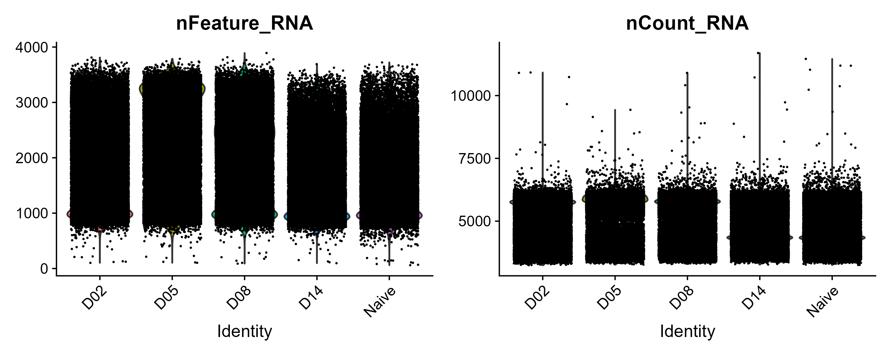
 
<b>Figure 1. Pre-filtered Violin plots for nFeature_RNA and nCount_RNA. </b> Violin plots showing the number of detected genes (nFeature_RNA, left) and total counts (nCount_RNA, right) per cell across five samples prior to filtering. Distributions are consistent across all samples, reflecting high baseline data quality.

 
Violin plots were used to evaluate the quality of the data in the provided Seurat object. Figure 1 demonstrates the distributions of nFeature_RNA and nCount_RNA, which are the number of detected genes and the total RNA counts per cell across the five time points. These violin plots show a decent distribution across all samples. The filtering thresholds based on this plot were set to nFeature_RNA between 500 and 3,800 and nCount_RNA between 1,000 and 10,000. The nFeature_RNA threshold was chosen to cut off the lower tail while retaining the upper range. The nCount_RNA threshold was chosen to preserve the majority of cells while still capturing the variation in the upper tails across the different time points.
 

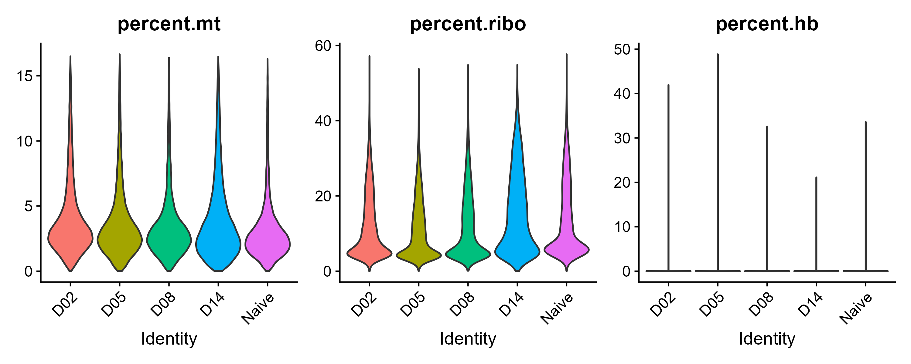
 
<b>Figure 2. Pre-filtered Violin plots for mitochondrial, ribosomal, and hemoglobin gene percentages. </b> Violin plots showing the percentage of mitochondrial (percent.mt, left), ribosomal (percent.ribo, middle), and hemoglobin (percent.hb, right) gene counts per cell across five samples prior to filtering. Individual cells are shown for percent.hb to highlight the sparse distribution of hemoglobin-expressing cells.

 
Figure 2 shows the distributions of mitochondrial, ribosomal, and hemoglobin gene percentages across all five time points. High proportions of these genes can introduce noise into the biological signal [18]. The majority of cells showed low mitochondrial and hemoglobin percentages, with only rare extreme outliers. To reduce this noise, cells were filtered at thresholds of less than 15% mitochondrial, less than 50% ribosomal, and less than 5% hemoglobin reads [18]. Both figures demonstrate a relatively clean distribution, suggesting that only minor filtering would be required. 
 

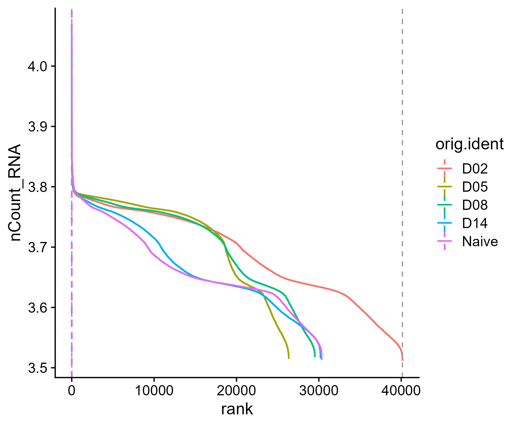
 
<b>Figure 3. Pre-filtering knee plot of cells ranked by total RNA counts. </b> Cells from all five time points (Naive, D02, D05, D08, D14) are ranked by total count (log10 nCount_RNA). The gradual and consistent decline across all samples indicates that the vast majority of cells are of high quality, supporting the use of minimal filtering thresholds

 
Figure 3. Pre-filtering knee plot of cells ranked by total RNA counts. Cells from all five time points (Naive, D02, D05, D08, D14) are ranked from highest to lowest total RNA count (log10 nCount_RNA). The curve shows a clear inflection point early in the distribution, where all five samples converge at high nCount_RNA values before gradually declining. This gradual decline rather than a sharp drop off suggests that the majority of detected cells are real, high quality cells with no obvious contamination from empty droplets. Overall, this supported the filtering thresholds chosen from the violin plots and confirmed that the dataset required only minimal filtering.
 
 

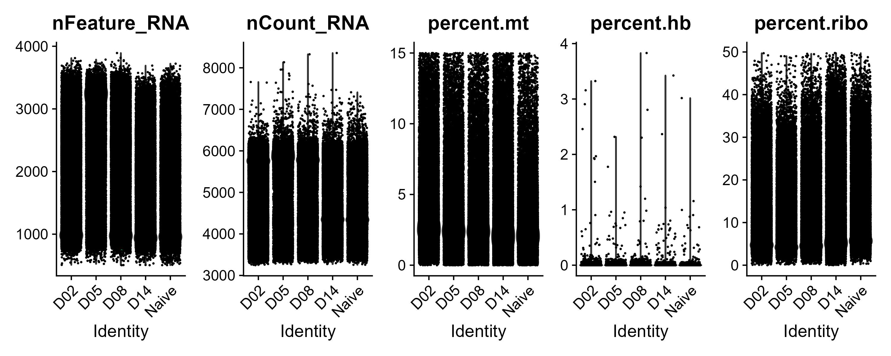
 
<b>Figure 4. Post-filtered Violin plots for all QC conditions. </b> Violin plots showing the distribution of detected genes, total counts, mitochondrial, hemoglobin, and ribosomal gene percentages per cell across five sampling times following quality control filtering. Individual cells are shown for percent.hb to highlight the sparse distribution of hemoglobin-expressing cells.

 
Figure 4. Post-filtering violin plots of key quality control metrics across all five time points Naive, D02, D05, D08, D14. Distributions are shown for all quality control metrics chosen for filtering. Following filtering, all samples show tighter and more consistent distributions across all metrics, with low mitochondrial and hemoglobin percentages and the removal of extreme outliers, confirming the effectiveness of the applied filtering thresholds.
 

<b>Table 1.</b> Pre- and post-filtering cell counts per condition.

| Condition | Pre-filtering | Post-filtering | Cells Removed | % Removed |
|-----------|--------------|----------------|---------------|-----------|
| D02 | 40,148 | 40,002 | 146 | 0.36% |
| D05 | 26,344 | 26,235 | 109 | 0.41% |
| D08 | 29,523 | 29,414 | 109 | 0.37% |
| D14 | 30,203 | 30,054 | 149 | 0.49% |
| Naive | 30,354 | 30,261 | 93 | 0.31% |
| **Total** | **156,572** | **155,966** | **606** | **0.39%** |

### Single-Cell Analysis 
 

 
<b>Figure 5. Elbow plot of first 50 PCs. </b> Standard deviation explained by each of the top 50 principal components (PCs). The curve gradually flattens beyond PC 40, suggesting that the majority of meaningful biological variation is captured within the first 40 PCs, which were selected for downstream clustering and dimensionality reduction.

 
Following normalization, HVG selection, and scaling, PCA was performed on the scaled HVGs to reduce the dimensionality of the data. Figure 5 displays the elbow plot of the first 50 principal components. The curve shows a gradual decline in standard deviation, beginning to flatten beyond PC 40, suggesting that the majority of meaningful biological variation is captured within the first 40 PCs. Based on this, the first 40 PCs were selected for downstream clustering and dimensionality reduction, which is consistent with the selection made by the original authors [3, 20].
 

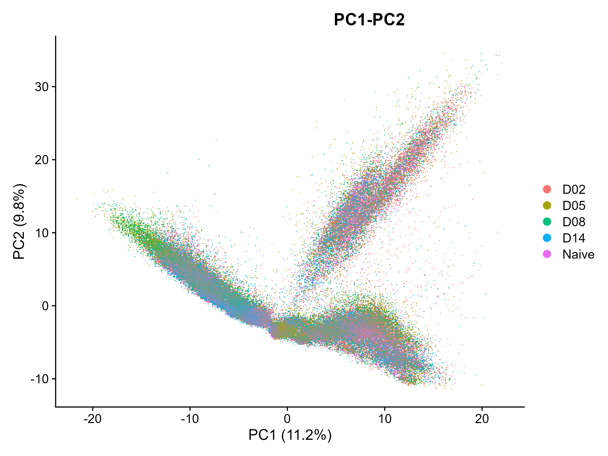
 
<b>Figure 6. PC1-PC2 plot of cells across all samples. </b> Scatter plot of cells projected onto the first two principal components (PC1: 11.2%, PC2: 9.8%), colored by sample identity. Cells from all five samples intermix across the principal component space.

 
Figure 6 displays the PC1-PC2 plot, where cells from all five time points are well mixed across the PCA space, suggesting minimal batch effects. The distinct arms visible in the plot likely reflect major cell populations present across all samples.
 
 

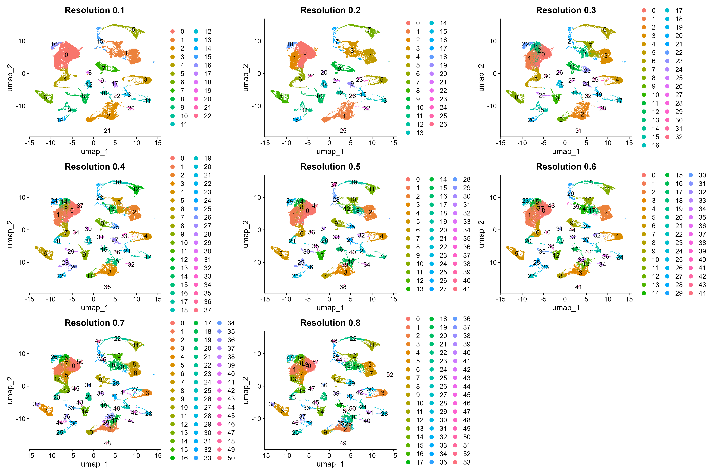
 
<b>Figure 7. Clustering resolution comparison for UMAPs. </b> UMAP visualizations of cells clustered at resolutions 0.1 through 0.8, yielding 22 to 53 clusters respectively. Increasing resolution results in progressive subdivision of cell populations. These plots were used to identify an optimal clustering resolution that balances biological interpretability with sufficient granularity for downstream cell type annotation.

 

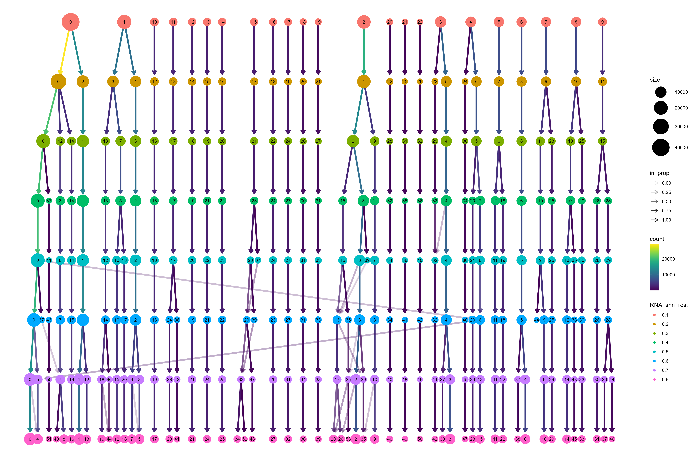
 
<b>Figure 8. Clustree diagram showing cluster stability across resolutions. </b> Clustree plot displaying how clusters evolve across resolutions 0.1 to 0.8. The optimal resolution was selected at the point where clusters remain stable with few spurious branching events, balancing cluster granularity with interpretability.

 
UMAP is a dimensionality reduction method that captures non-linear patterns of variation, allowing for the visualization of complex cell population structure. Following the construction of the SNN graph using the first 40 PCs, clustering was performed and visualized using UMAP. Figure 7 displays UMAP plots across resolutions 0.1 to 0.8, showing an increasing number of clusters with higher resolutions. Figure 8 displays the clustree plot, where increasing random branching at higher resolutions indicated over-clustering, while resolution 0.4 showed stable clusters without any random branches. Based on this, a resolution of 0.4 was selected as the point where clusters were stable and biologically interpretable. The original authors used a higher resolution of 0.6, however this was supported by multiple rounds of filtering that produced a more refined dataset [3, 20]. Given that this analysis used a single filtering round, a more conservative resolution of 0.4 was chosen
 
 

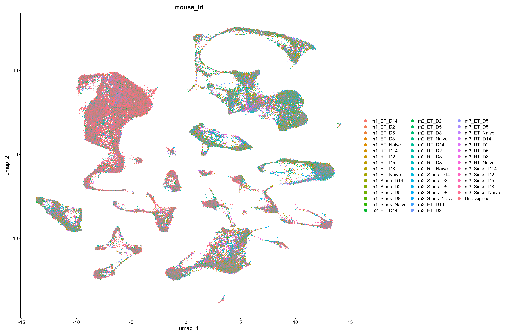
 
<b>Figure 9. UMAP colored by mouse and tissue identity. </b> Clustree diagram showing cluster stability across resolutions. </b> UMAP visualization of all cells colored by individual mouse, tissue type (ET, RT, Sinus), and timepoint (Naïve, D02, D05, D08, D14).

 
Figure 9 confirms minimal batch effects, as cells from all three mice and conditions are well mixed throughout the UMAP rather than clustering by sample identity, justifying the decision to proceed without batch correction.
 
 

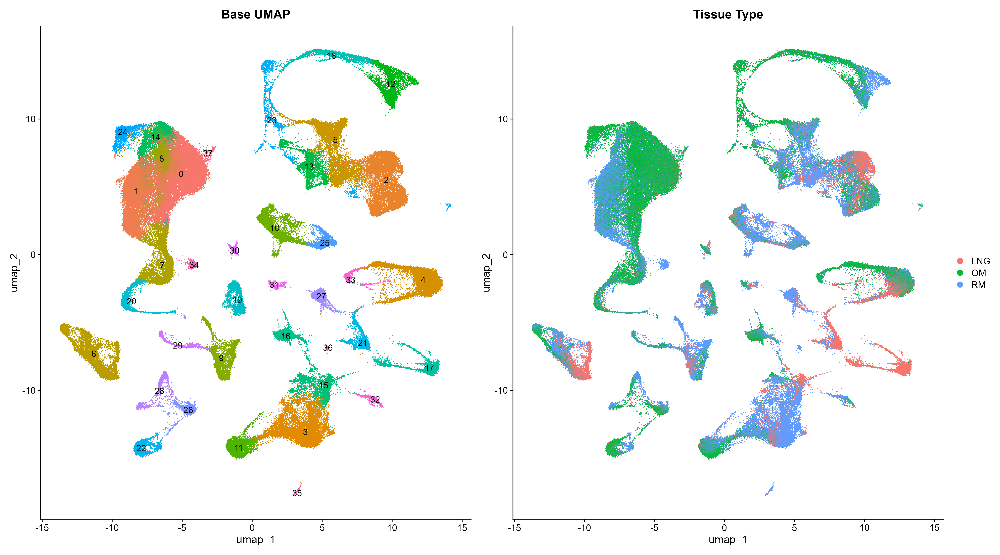
 
<b>Figure 10. UMAP visualization of cell clusters and tissue type distribution. </b> UMAP plots showing all cells colored by cluster identity (left, 38 clusters) and tissue type (right; LNG, OM, RM). 

 
Figure 10 displays the base UMAP with 38 clusters alongside the UMAP colored by tissue type (LNG, OM, RM). While some clusters show tissue-specific enrichment, the majority of clusters contain cells from multiple tissue types, suggesting that clustering is primarily driven by cell type rather than tissue of origin. This further supports that the clustering reflects meaningful biological variation rather than technical differences between tissues
 
 

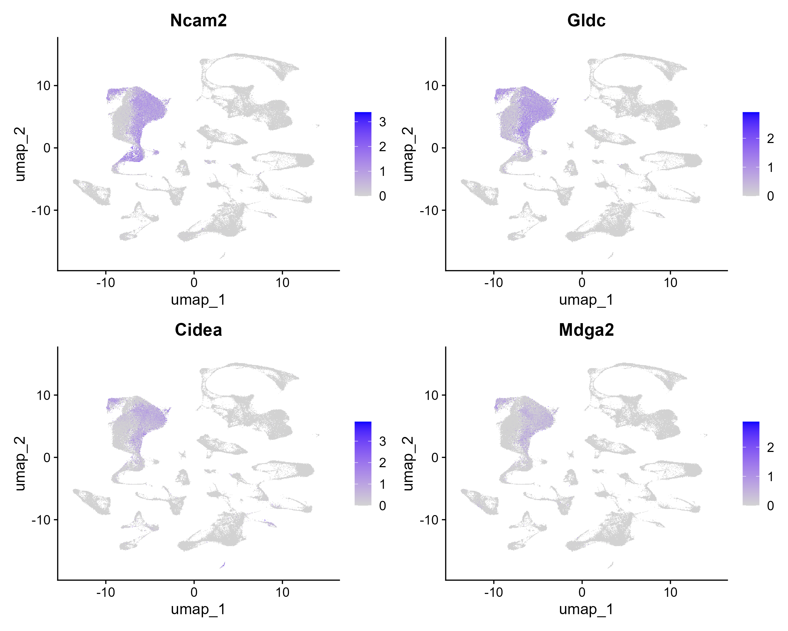
 
<b>Figure 11. Feature plots of top marker genes used to annotate cluster 0 </b> UMAP feature plots showing normalized expression of the four most significant marker genes for cluster 0 (Ncam2, Gldc, Cidea, and Mdga2). Expression is specifically enriched in a distinct region of the UMAP, supporting the annotation of this cluster as olfactory neurons. This approach was repeated for all major clusters to guide manual cell type annotation.

 
Once the optimal resolution of 0.4 was identified, cell type annotation was performed. Both manual and automated annotation were carried out to allow for a comparison between the two approaches. Manual annotation was performed by identifying the top marker genes for each cluster and researching their known biological functions to infer cell type identity. Figure 11 displays an example of this process for cluster 0, showing feature plots of the top four marker genes (Ncam2, Gldc, Cidea, and Mdga2), where expression is specifically enriched in a distinct region of the UMAP, supporting the annotation of this cluster as olfactory neurons. This approach was repeated across all major clusters. 
 

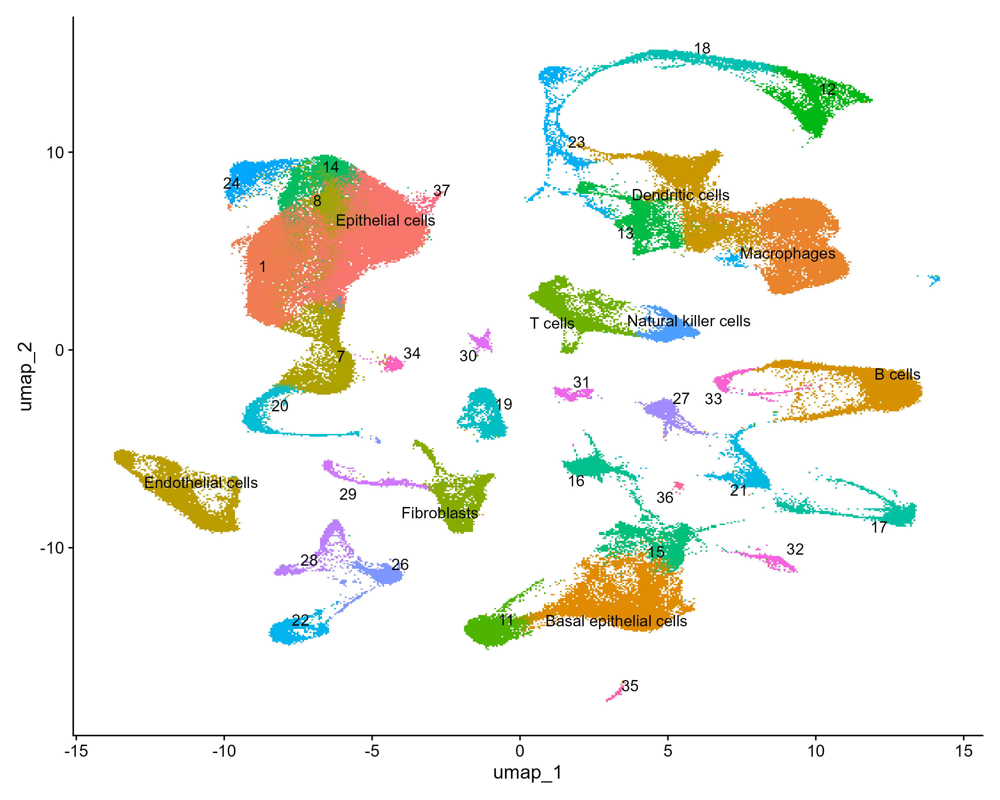
 
<b>Figure 12. UMAP of manually annotated cell types. </b> UMAP visualization of all cells following manual annotation, identifying 14 distinct cell populations including immune cells (neutrophils, macrophages, monocytes, dendritic cells, T cells, NK cells, B cells), structural cells (endothelial, fibroblasts, pericytes, basal cells), and nasal-specific cell types (olfactory neurons, sustenacular cells). Cell type identity was assigned based on known marker gene expression. Unresolved clusters are labeled as "Other."

 

Figure 12 displays the resulting manually annotated UMAP, where distinct cell populations form well-separated clusters, reflecting the biological diversity of the nasal mucosa. Both immune and structural cell types were successfully identified, along with nasal-specific populations that are characteristic of this tissue. The presence of these cell types is consistent with the three tissue types present in this dataset, being the RM, OM, and LNG.

 

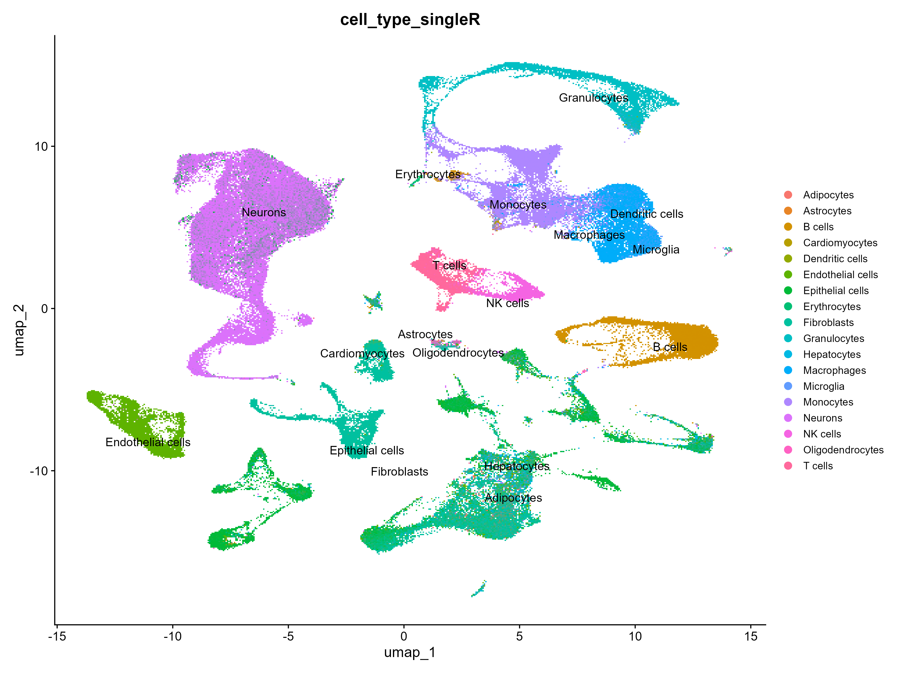
 
<b>Figure 13.  UMAP of SingleR automated cell type annotation. </b> UMAP visualization of all cells annotated using SingleR with the mouse immune and general mouse reference datasets, identifying 27 predicted cell types.

 
Figure 13 displays the SingleR automated annotation, which predicted 27 cell types using the MouseRNAseqData and ImmGenData reference datasets. While several major populations were consistent with the manual annotation, SingleR predicted cell types not expected in nasal tissue such as hepatocytes and adipocytes, likely as a result of the broad MouseRNAseqData reference not accurately reflecting the tissue being studied. As a result, manual annotation was used to guide the final cell type assignments.
 

### DGE analysis

 

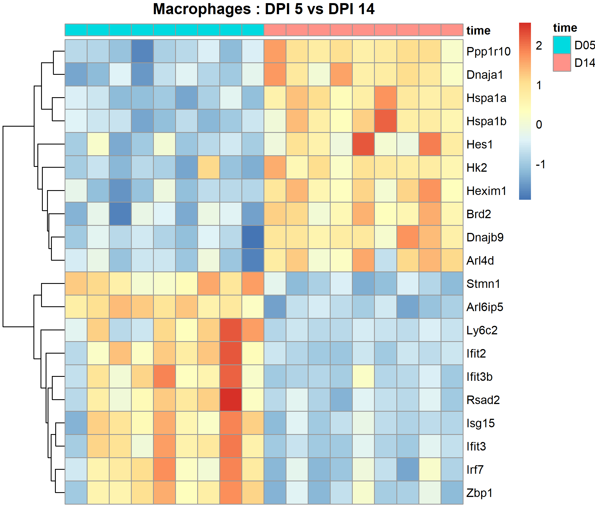
 
<b>Figure 14.  Heatmap of differentially expressed genes in macrophages between DPI 5 and DPI 14. </b> Heatmap showing scaled expression of the top differentially expressed genes in macrophages at day 5 (teal) and day 14 (pink) post-infection. Interferon-stimulated genes (Ifit2, Rsad2, Isg15, Irf7) are enriched at DPI 5, while heat shock and regulatory genes (Hspa1a, Hspa1b, Hes1) are more prominent at DPI 14, suggesting a shift from an acute antiviral to a more regulatory macrophage response over time.

 

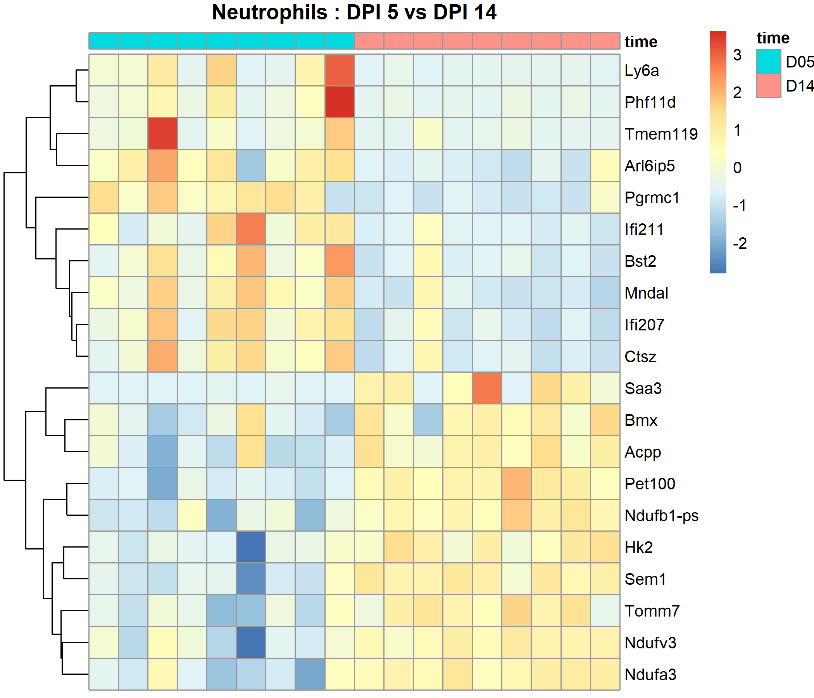
 
<b>Figure 15.  Heatmap of differentially expressed genes in neutrophils between DPI 5 and DPI 14. </b> Heatmap showing scaled expression of the top differentially expressed genes in neutrophils at day 5 (teal) and day 14 (pink) post-infection. Some interferon-related genes (Ifi211, Bst2) show higher expression at DPI 5, while metabolic genes (Ndufv3, Ndufa3) are modestly elevated at DPI 14, though the overall transcriptional differences between timepoints are less pronounced than those observed in macrophages.

 

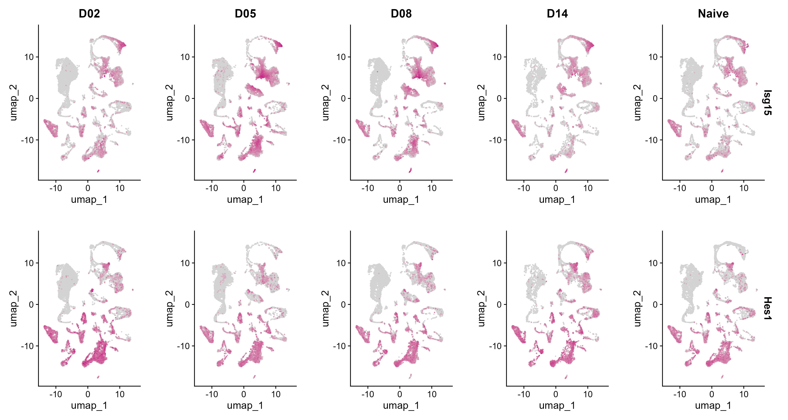
 
<b>Figure 16.  Feature plots of Isg15 and Hes1 expression across timepoints in macrophages. </b> UMAP feature plots showing expression of Isg15 (top) and Hes1 (bottom) across all five timepoints (D02, D05, D08, D14, Naïve). Isg15 expression is notably elevated at D05 and declines by D14, consistent with an early antiviral interferon response. Hes1 expression appears more broadly distributed across timepoints, with relatively stable expression into D14, supporting its role in the later regulatory macrophage state identified in the heatmap analysis.

 

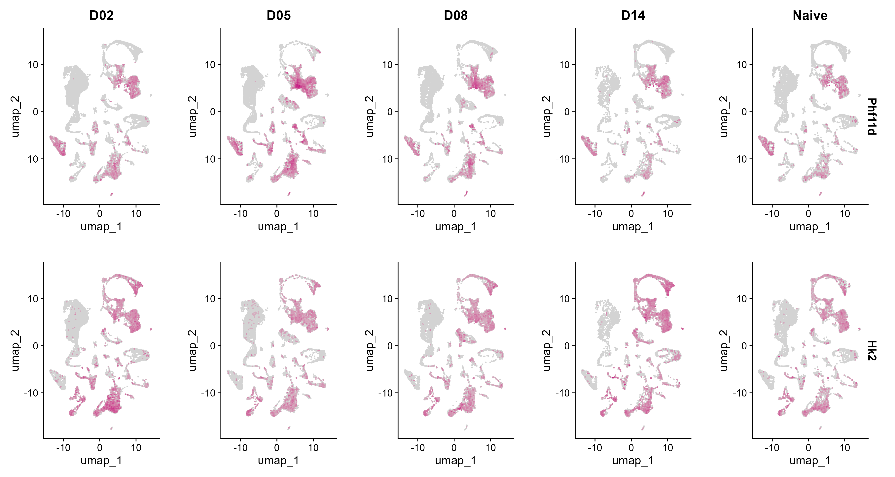
 
<b>Figure 17.  Feature plots of Phf11d and Hk2 expression across timepoints in neutrophils. </b> UMAP feature plots showing expression of Phf11d (top) and Hk2 (bottom) across all five timepoints (D02, D05, D08, D14, Naïve). Phf11d expression appears elevated at D05 and declines by D14, consistent with an early immune activation response. Hk2 expression is more broadly distributed across timepoints with less pronounced temporal changes, reflecting the more modest transcriptional differences observed in neutrophils compared to macrophages.

 

### Over-representation analysis (ORA)
 

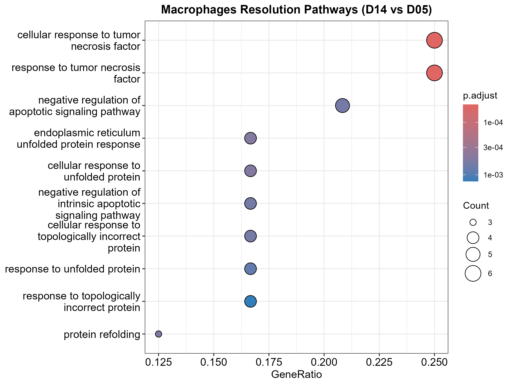
 
<b>Figure 18.  Gene Ontology (GO) ORA of macrophage pathways at DPI 14 versus DPI 5. </b> Dot plot showing GO biological pathways significantly enriched in macrophages at DPI 14 compared to DPI 5. Dot size represents the number of genes in each pathway and color indicates statistical significance. TNF response pathways are the most strongly enriched, alongside pathways related to protein stress responses and cell survival, suggesting macrophages remain actively engaged in inflammatory signaling and stress management during the resolution phase of infection.

 

## Discussion 

## References
[1] N. Zhang, K. Van Crombruggen, E. Gevaert, and C. Bachert, “Barrier function of the nasal mucosa in health and type-2 biased airway diseases,” Allergy, vol. 71, no. 3, pp. 295–307, Jan. 2016, doi: https://doi.org/10.1111/all.12809.  
[2] F. Zhu et al., “H1N1 Influenza Virus-Infected Nasal Mucosal Epithelial Progenitor Cells Promote Dendritic Cell Recruitment and Maturation,” Frontiers in Immunology, vol. 13, no. 879575, Apr. 2022, doi: https://doi.org/10.3389/fimmu.2022.879575.   
[3] S. W. Kazer et al., “Primary nasal influenza infection rewires tissue-scale memory response dynamics,” Immunity, vol. 57, no. 8, pp. 1955-1974.e8, Aug. 2024, doi: https://doi.org/10.1016/j.immuni.2024.06.005.   
[4] C. Contreras, J. M. Newby, and T. Hillen, “Personalized Virus Load Curves for Acute Viral Infections,” Viruses, vol. 13, no. 9, p. 1815, Sep. 2021, doi: https://doi.org/10.3390/v13091815.   
[5] A. Iwasaki and P. S. Pillai, “Innate immunity to influenza virus infection,” Nature Reviews Immunology, vol. 14, no. 5, pp. 315–328, Apr. 2014, doi: https://doi.org/10.1038/nri3665.   
[6] F. A. Wolf, P. Angerer, and F. J. Theis, “SCANPY: large-scale single-cell gene expression data analysis,” Genome Biology, vol. 19, no. 1, Feb. 2018, doi: https://doi.org/10.1186/s13059-017-1382-0.   
[7] R. A. Amezquita et al., “Orchestrating single-cell analysis with Bioconductor,” Nature Methods, vol. 17, no. 2, Dec. 2019, doi: https://doi.org/10.1038/s41592-019-0654-x.   
[8] I. Billato et al., “Benchmarking large-scale single-cell RNA-seq analysis,” Oct. 2025, doi: https://doi.org/10.1101/2025.10.28.681564.   
[9] R. Satija, “Seurat,” Satijalab.org, 2019. https://satijalab.org/seurat/   
[10] D. Aran et al., “Reference-based analysis of lung single-cell sequencing reveals a transitional profibrotic macrophage,” Nature Immunology, vol. 20, no. 2, pp. 163–172, Feb. 2019, doi: https://doi.org/10.1038/s41590-018-0276-y.    
[11] V. Y. Kiselev, A. Yiu, and M. Hemberg, “scmap: projection of single-cell RNA-seq data across data sets,” Nature Methods, vol. 15, no. 5, pp. 359–362, Apr. 2018, doi: https://doi.org/10.1038/nmeth.4644.   
[12] J. K. de Kanter, P. Lijnzaad, T. Candelli, T. Margaritis, and F. C. P. Holstege, “CHETAH: a selective, hierarchical cell type identification method for single-cell RNA sequencing,” Nucleic Acids Research, vol. 47, no. 16, Jun. 2019, doi: https://doi.org/10.1093/nar/gkz543.    
[13] Q. Huang, Y. Liu, Y. Du, and L. X. Garmire, “Evaluation of Cell Type Annotation R Packages on Single-cell RNA-seq Data,” Genomics, Proteomics & Bioinformatics, vol. 19, no. 2, Dec. 2020, doi: https://doi.org/10.1016/j.gpb.2020.07.004.   
[14] A. L. Thurman, J. A. Ratcliff, M. S. Chimenti, and A. A. Pezzulo, “Differential gene expression analysis for multi-subject single-cell RNA-sequencing studies with aggregateBioVar,” Bioinformatics, vol. 37, no. 19, pp. 3243–3251, Apr. 2021, doi: https://doi.org/10.1093/bioinformatics/btab337.   
[15] T. Wu et al., “clusterProfiler 4.0: A universal enrichment tool for interpreting omics data,” The Innovation, vol. 2, no. 3, p. 100141, Aug. 2021.  
[16] “Seurat - Guided Clustering Tutorial,” satijalab.org, Oct. 31, 2023. https://satijalab.org/seurat/articles/pbmc3k_tutorial.html  
[17] “Plot the Barcode Distribution and Calculated Inflection Points — BarcodeInflectionsPlot,” Satijalab.org, 2026. https://satijalab.org/seurat/reference/barcodeinflectionsplot (accessed Apr. 8, 2026).  
[18] M. Su et al., “Data analysis guidelines for single-cell RNA-seq in biomedical studies and clinical applications,” Military Medical Research, vol. 9, no. 1, Dec. 2022, doi: https://doi.org/10.1186/s40779-022-00434-8.  
[19] “Chapter 4 Clustering | scRNAseq Analysis in R with Seurat,” Github.io, 2025. https://swbioinf.github.io/scRNAseqInR_Doco/clustering.html (accessed Apr. 8, 2026).   
[20] jo-m-lab, “GitHub - jo-m-lab/IAV-nasal-sc-atlas at v1.0.0,” GitHub, May 02, 2024. https://github.com/jo-m-lab/IAV-nasal-sc-atlas/tree/v1.0.0 (accessed Apr. 8, 2026).   
[21] “Chapter 5 Using multiple references | Assigning cell types with SingleR,” Bioconductor.org, 2025. https://bioconductor.org/books/release/SingleRBook/using-multiple-references.html (accessed Apr. 8, 2026).  
[22] LTLA, “Obtain mouse bulk expression data of sorted cell populations...,” Rdrr.io, Jun. 03, 2024. https://rdrr.io/github/LTLA/celldex/man/MouseRNAseqData.html (accessed Apr. 8, 2026).   
[23] LTLA, “Obtain mouse bulk expression data from the Immunologic Genome...,” Rdrr.io, Jun. 03, 2024. https://rdrr.io/github/LTLA/celldex/man/ImmGenData.html (accessed Apr. 8, 2026).   
[24] “1. Introduction to BiocParallel,” Bioconductor.org, 2022. https://www.bioconductor.org/packages//release/bioc/vignettes/BiocParallel/inst/doc/Introduction_To_BiocParallel.html#clusters-of-independent-processes-with-snowparam (accessed Apr. 8, 2026).  
